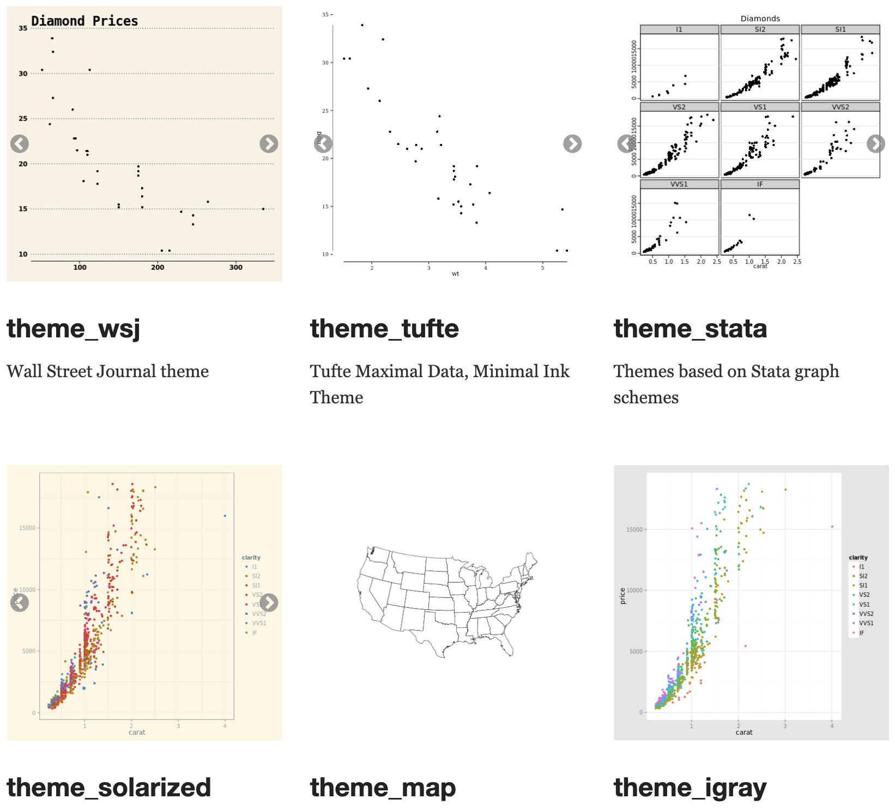

```{r setup, include=FALSE}
knitr::opts_chunk$set(echo = TRUE)
```

## Packages

-   readr - to read in data
-   ggplot2 - for plotting and theme function
-   ggthemes - for additional themes

If these packages are new to you, you will need to install them which you can do by replacing packageName with the name of the package you want to install in the code below. 

```{r, eval=F}
# If you need to install...
install.packages("packageName")
# If you need all of them, you can combine them in a list instead of installing one by one...
install.packages(c("package1", "package2", "etc"))
```

In addition to installing the packages to your computer, we also need to load them into our library so we can use their functions in this session.

```{r}
library(readr)
library(ggplot2)
library(ggthemes)
```

### Additional packages

-   ThemePark - for novelty themes
-   devtools OR remotes - for installation from github

These packages are optional for today, we're going to talk about ThemePark at the end which hosts themes based on different movies and tv shows. Because it's developmental it requires slightly different installation.

## Data

The data we're going to work with today includes data on pumpkin production in the United States from the years 2000 to 2022, and data on candy sales in the United States from the 1970s to the late 2010s.

Run the code chunk below to load the data into your environment.

```{r}
pumpkin_data <- read_csv("pumpkin_production.csv")
pumpkin_data$pumpkin_lbs <- pumpkin_data$pumpkin_kcwt*10

candy_data <- read_csv("candy_production_months.csv")
```

## Themes can be added to ggplots

So, we need to start with some plots! Run the code chunks below to create a barplot of pumpkin production called pumpkin_plot, and a line graph of candy sales over time called candy_plot.

```{r}
pumpkin_plot<-ggplot(pumpkin_data, aes(year, pumpkin_lbs))+
  geom_col()+
  labs(x="Year", y="Pumpkin production (lbs)", title = "Pumpkin Production", subtitle= "in the United States over the years 2000-2022")

pumpkin_plot
```

```{r}
candy_plot <- ggplot(candy_data, aes(date, amount))+
  geom_line()+
  geom_point(data = candy_data[candy_data$month == "10",], aes(color = ifelse(month == "10", "October", "Rest of Year")))+
  scale_color_manual(values = c("orange", "black"))+
  labs(color = "", x = "Year", y = "Amount of candy sold")+
  theme(legend.position = "bottom")

candy_plot
```

Both of these plots start with a ggplot() call to initialize the plotting window and set axes, and then add different geoms to plot the data, and code to set labels and control colors.

The candy_plot code also includes a line that adds the theme() function to the graph. In this case, it is being used to control where the legend appears but it could do a lot more!

Let's get a sense for what theme() controls with examples of built in themes.

## Built in themes

There are some theme options built into ggplot2:

-   theme_minimal()
-   theme_bw()
-   theme_void()
-   theme_classic()
-   theme_light()
-   theme_linedraw()
-   theme_dark()

You can combine them with your plot object to change the theme, and overall look of the graph. Many of these are designed to looked more polished and less busy.

If you already have a ggplot object you can add a theme to it as in the example below. If you are creating a ggplot object, theme functions can be added the same way you add geoms or other aspects of the plot.

### Example:

```{r}
pumpkin_plot+theme_minimal()
```

### Exercise 1:

Explore some of the built in theme options with the pumpkin_plot.

```{r}

```

## Theme function

You can see from the built in themes that this function controls different aspects of a plot's appearance, including the background, the gridlines, outlining, and labels. You could specify each of these manually to create a custom theme.

theme() can take many different named arguments that refer to different components of the graph. These arguments are then controlled with the appropriate element function depending on what type of element they are.

### Text elements

Text elements include all of the text on the graph, and different components of text on the graph:

#### Example:

```{r}
pumpkin_plot+
  theme(text = element_text(color = "orange"))

pumpkin_plot+
  theme(plot.title = element_text(color = "orange"))

pumpkin_plot+
  theme(axis.text.x = element_text(color = "orange"))

```

I'm using color to illustrate what parts of the graph my code is controlling, but you can change more than color with these functions.

```{r}
pumpkin_plot+
  theme(axis.text.x = element_text(color = "orange", size=20))
```

Remember you can always reference the documentation for a function by searching for it in the help panel or by running ?funcionName() in the console.

#### Exercise 2:

Change the axis labels on the candy_plot.

```{r}

```

### Line elements

```{r}
pumpkin_plot+
  theme(panel.grid = element_line(color = "orange"))

pumpkin_plot+
  theme(axis.ticks.x = element_line(color = "orange", linewidth = 2))
```

### Rectangle elements

```{r}
pumpkin_plot+
  theme(panel.background = element_rect(fill = "orange"))

pumpkin_plot+
  theme(plot.background = element_rect(fill = "orange"))
```

### Blank elements

To remove a component of a graph, you can set it to a blank element, regardless of what type of element it starts as.

#### Example

```{r}
pumpkin_plot+theme(panel.background = element_blank())
```

#### Exercise 3:

Remove the subtitle from pumpkin_plot().

```{r}

```

### Putting elements together

You can combine these arguments in one theme function to control multiple components of a graph even if they are different elements.

#### Example:

```{r}
pumpkin_plot+theme(panel.background = element_blank(),
                   panel.grid = element_line(color = "orange"))
```

#### Exercise:

Remove the panel background from the candy_plot and increase the size of all the text.

```{r}

```

### Non-element arguments and ordering

Some arguments to the theme function don't use element functions, especially a lot of the arguments controlling the legend.

The position of the legend can be set to "left", "right", "top", or "bottom", like in the original code defining candy_plot. To remove a legend, set legend.position = "none" instead of to element_blank().

Even though candy_plot() already has a theme() call at the end that sets the position of the legend, that can be overridden by a subsequent theme() call.

```{r}
candy_plot+theme(legend.position = "right")
```

Like of there aspects of the plot, themes are applied in order. That can be helpful if you like one of the built ins, but want to add a couple of adjustments.

#### Example:

```{r}
candy_plot+theme_classic()
candy_plot+theme_classic()+theme(text = element_text(size=15))
```

## Themes also apply to faceted graphs

```{r}
candy_month_plot <- ggplot(candy_data[candy_data$year<1981,], aes(month, amount))+
  geom_col()+
  labs(x = "Month", y = "Amount of candy sold")+
  facet_wrap(vars(year))

candy_month_plot
```

This adds elements controlling the facet titles which ggplot2 refers to as strips.

### Example:

```{r}
candy_month_plot+theme(strip.background = element_rect(color = "red"))
```

### Exercise 4:

Change the background color of the facet titles to white and the size of the text to 12.

```{r}

```

## Other packages also include theme options

### ggthemes

From the authors of the package: ggthemes provides "[s]ome extra themes, geoms, and scales for 'ggplot2'...'ggplot2' themes and scales that replicate the look of plots by Edward Tufte, Stephen Few, 'Fivethirtyeight', 'The Economist', 'Stata', 'Excel', and 'The Wall Street Journal', among others, [also] provides 'geoms' for Tufte's box plot and range frame."



<https://yutannihilation.github.io/allYourFigureAreBelongToUs/ggthemes/>

### ThemePark

ThemePark is a collaborative package that contains themes based on movies and tv shows. They are open to contributions, so if you have a favorite movie with a particular cinematic look creating a theme for it might be really fun coding practice!

<https://github.com/MatthewBJane/ThemePark>

To install ThemePark (or other packages from GitHub) you can use the install_github() function from either devtools or remotes. devtools and remotes should be installable using install.packages()

```{r, eval=F}
devtools::install_github("MatthewBJane/ThemePark")
library(ThemePark)
```

You are welcome to try this, if it doesn't work on your computer we are not going to troubleshoot today but if there are other packages you'd like to install from GitHub please fill out a consultation request so we can get that working for you.

#### Example:

```{r, eval=F}
candy_plot
```

#### Exercise 5:

Explore some themes from ggthemes and/or ThemePark if you have it installed.

```{r}

```

